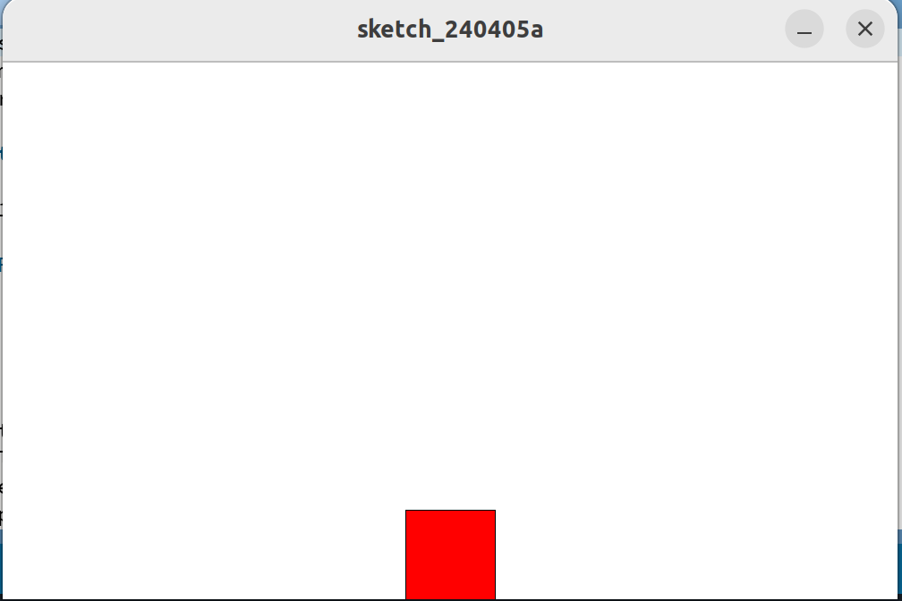

This is a simulation of a square of mass $m$, which is on a surface with a friction coefficient $\alpha$. The user can apply a constant external force on the square. And the square is bouncing on the walls. The walls have a coefficient $\beta$. The velocity along the x axis after a collision with a wall  $v_{out,x}$ is given by $v_{out,x}=-\beta \cdot v_{in,x}$ with $v_{in,x}$ the velocity of the square before the collision. $0 \leqslant \beta \leqslant 1$.

The integration method to obtain the velocity and position is the forward Euler method. The method is called four times between each frames.

Image of the program running

#### How to run the code
 Simply install Processing and run the simple_mechanics_sim.pde code.  

#### Commands:  
* Press a to apply a constant force to the left  
* Press z to apply a constant force to the right  
When the user doesn't press any key there is no external force applied.

